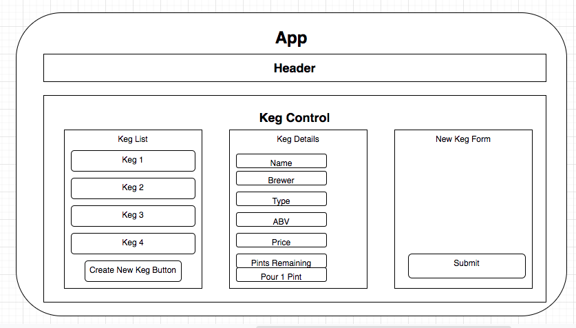

### _This project is not in a complete or portfolio ready state, and should not be considered representiational of professional work._

# Tap Room

### Epicodus Independent Code Review - React Fundamentals

### By Collin Chapman

## Technologies Used

* Git
* JavaScript
* React
* JSX
* CSS
* HTML

## Description

This is part 1 of a 2 part application where a bar can track their keg inventory.

## Setup/Installation Requirements

* _Requires Visual Studio Code Installation_
* _Requires Terminal Installation_
* _Open the terminal on your local machine_
* _Navigate to the directory inside of which you wish to house this project_
* _Clone this project with the following command  `$ git clone https://github.com/colchapm/tap-room.git`_
* _Navigate to the root directory by entering `$ cd tap-room`_
* _Open this project in Visual Studio Code with the command `$ code .`_
* _Retrieve and install packages needed to run this application with `$ npm install`_
* _Run the application in development mode with `$ npm run start`_
* _Open [http://localhost:3000](http://localhost:3000) to view it in the browser_

## Component Diagram

## Known Bugs

No known bugs at this time

## Improvement Opportunities

* Add Edit and Delete functionality
* Additional Styling

## Link

https://colchapm.github.io/tap-room/

## License

Copyright (c) 2021 Collin Chapman

This software is licensed under the MIT license

## Contact Information

cchap14@gmail.com